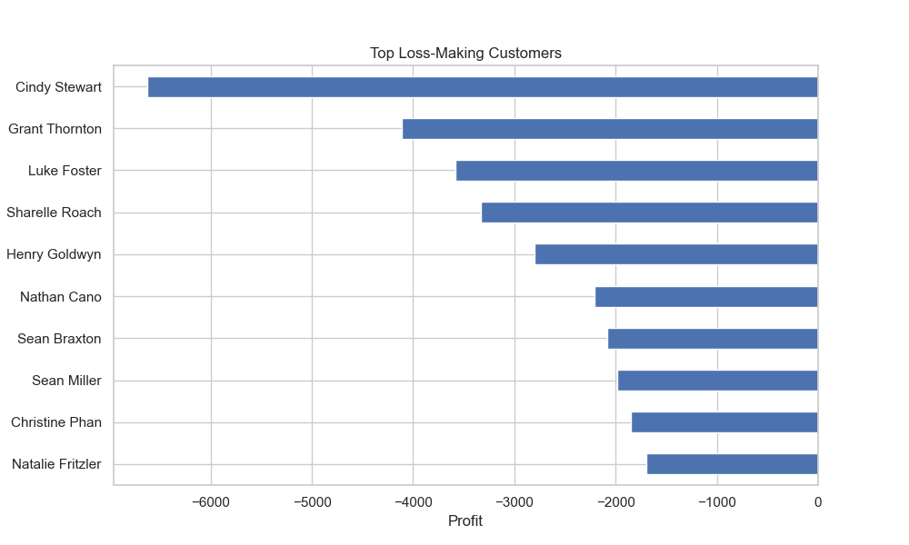

# Day 1 - Superstore Sales Analysis using Python

## Project Overview

This project is part of my **31 Days Data Analytics & Data Science Challenge**.

In this project, I performed Exploratory Data Analysis (EDA) on a retail Superstore dataset using Python to analyze customer behavior, sales performance, profit trends, and business KPIs.

The project focuses on understanding business performance through data analysis and generating actionable business insights.

---

# Tools & Technologies Used

* Python
* Pandas
* NumPy
* Matplotlib
* Seaborn
* Jupyter Notebook
* Git & GitHub

---

# Project Workflow

1. Data Loading
2. Data Understanding
3. Data Cleaning
4. Feature Engineering
5. Univariate Analysis
6. Bivariate Analysis
7. Multivariate Analysis
8. KPI Analysis
9. Customer Segmentation
10. Business Insights
11. Conclusion

---

# KPIs Analyzed

* Total Sales
* Total Profit
* Total Orders
* Total Customers
* Average Order Value
* Profit Margin
* Sales by Category
* Profit by Region
* Customer Segmentation
* Discount Impact on Profit

---

# Analysis Performed

## Univariate Analysis

* Sales Distribution
* Profit Distribution
* Orders by Ship Mode

## Bivariate Analysis

* Sales vs Profit
* Discount vs Profit
* Category vs Sales
* Region vs Profit

## Multivariate Analysis

* Correlation Heatmap
* Region + Category + Profit Analysis

---

# Customer Segmentation

Customers were segmented into:

* Low Value Customers
* Medium Value Customers
* High Value Customers
* VIP Customers

This helped identify valuable customers and business growth opportunities.

---

# Key Business Insights

* Technology category generated the highest sales and strong profit.
* The West region contributed significantly to business profitability.
* Higher discounts negatively impacted profit margins.
* Some products generated losses despite high sales.
* VIP customers contributed major revenue to the business.

---

# Charts & Visualizations

The project includes:

* Bar Charts
* Histogram
* Line Charts
* Scatter Plots
* Pie Charts
* Heatmap
* Customer Segmentation Analysis
 ---

# Conclusion

This project helped me understand:

* real-world business analysis
* KPI calculation
* customer segmentation
* trend analysis
* sales and profit analysis
* data visualization
* business insights using Python

Overall, this project strengthened my practical understanding of Data Analytics and Business Analysis.
# Project Visualizations

## Sales by Category


---

## Profit by Region

)

---

## Monthly Sales Trend


---

## Monthly Profit Trend


---

## Sales by Customer Segment


---

## Profit Distribution


---

## Sales by Region


---

## Orders by Ship Mode


---

## Sales vs Profit


---

## Discount vs Profit


---

## Correlation Heatmap


---

## Top 10 Products by Sales


---

## Customer Segmentation


---

## Customer Segments Share


---

## Top Customers by Sales


---

## Top Customers by Profit


---

## Top Loss-Making Customers



---

# Project Structure

```bash
Day1_Customer_Purchase_Analysis/
│
├── data/
├── notebook/
├── charts/
├── insights/
└── README.md
```

---

# Author

Gc
