# Day 1 - Superstore  Sales Analysis using Python

## Project Overview

This project is part  of my **31 Days Data Analytics & Data Science Challenge**.

In this project, I performed Exploratory Data Analysis (EDA) on a retail Superstore dataset using Python to analyze sales  performance, profit trends, customer behavior, business KPIs, and customer Segmentation.

The main objective of this project is to understand business performance and generate actionable insights using data  analysis 

---

## Tools & Technologies Used  

- Python
- Pandas
- NumPy
- Matplotlib
- Seaborn
- Jupyter Notebook
- Git & GitHub

---

## Project Workflow

1. Data Loding 
2. Data Understanding
3. Data Cleaning
4. Feature Engineering
5. Univariate Analysis
6. Bivariate Analysis
7. Multivariate Analysis
8. KPI Analysis
9. Customer Segmentation
10. Business Insights
11. Conclusion

---

## KPIs Analyzed

- Total Sales
- Total Profit
- Total Orders
- Total Customers
- Average Order Value
- Profit Margin
- Sales by Category
- Profit by Region
- Discount Impact on Profit
- Customer Segmentation

---

## Analysis Performed 

### Univariate Analysis

- Sales Distribution
- Profit Distribution
- Orders by ship mode

### Bivariate Analysis

- Sales vs Profit
- Discount vs Profit
- Category vs Sales
- Region vs Profit

### Multivariate Analysis

- Correlation Heatmap
- Region, Category, Sales and Profit Analysis

---

## Customer Segmentation

Customers were segmented into four groups:

- Low Value Customers
- Medium Value Customers
- High Value Customers
- VIP Customers

This segmentation helps businesses identify valuable customers and create targeted marketing strategies.

---

## Key Business Insights

- Technology category generated strong sales and profit.
- The West region contributed significantly to overall profitability.
- Higher discounts negatively impacted profit margins.
- Some products generated losses despite high sales.
- VIP customers contributed major revenue to the business.
- Monthly sales and profit trends helped identify business performance patterns.

---

# Project Visualizations

## Sales by Category
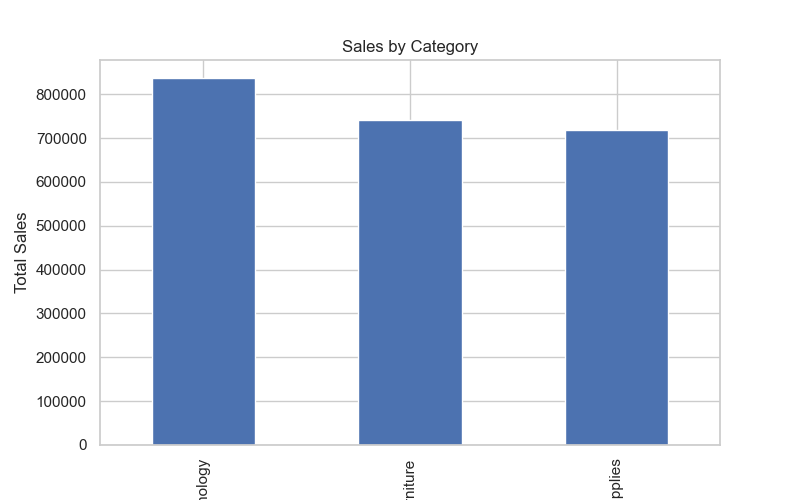

## Profit by Region
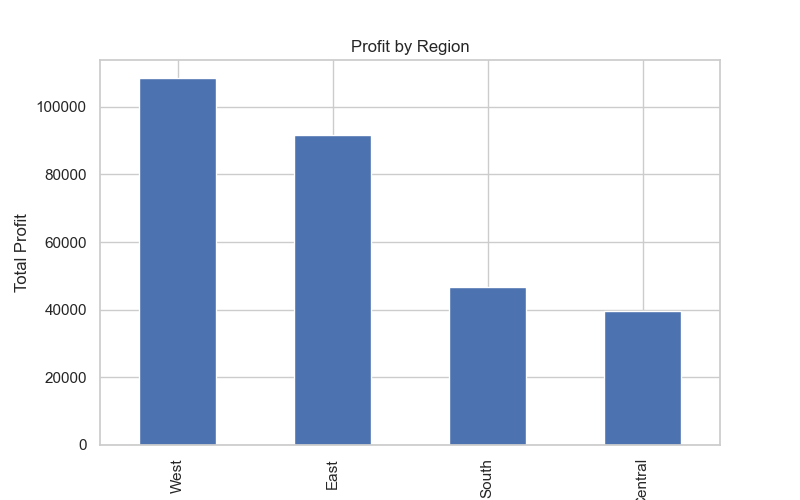

## Monthly Sales Trend
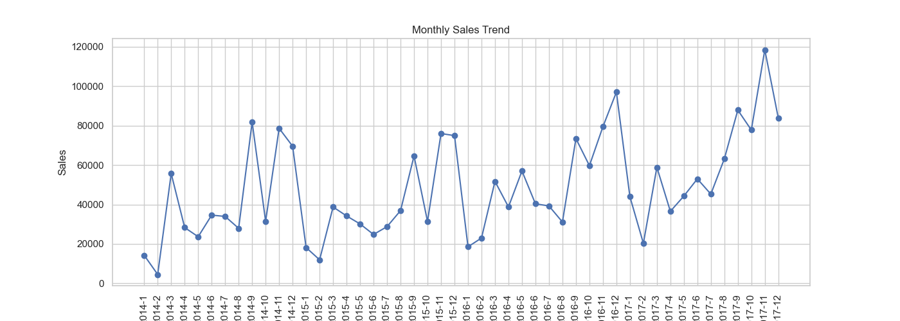

## Monthly Profit Trend
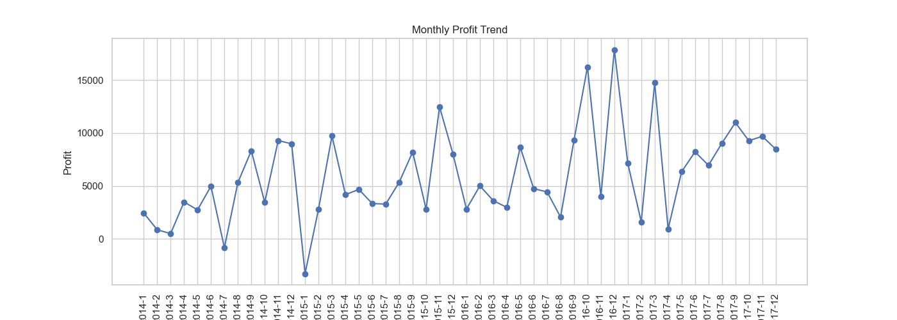

## Sales Distribution
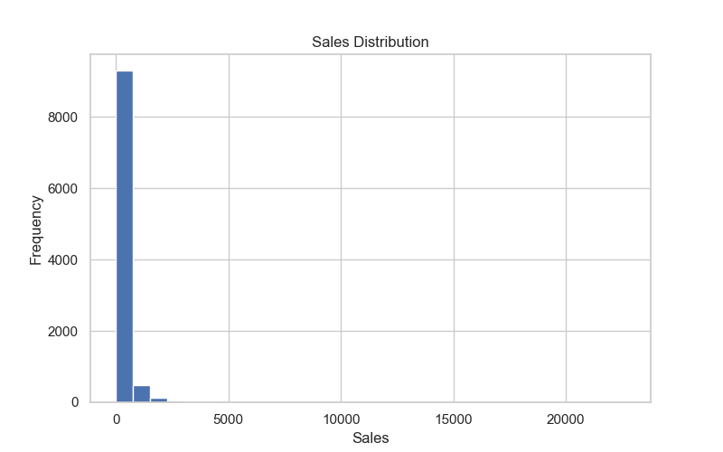

## Profit Distribution
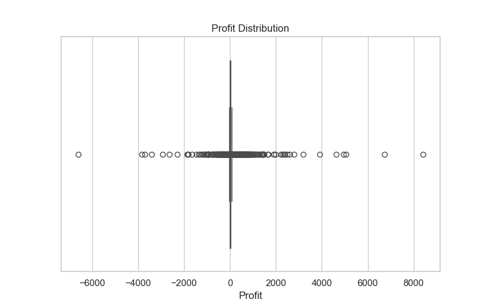

## Sales by Region
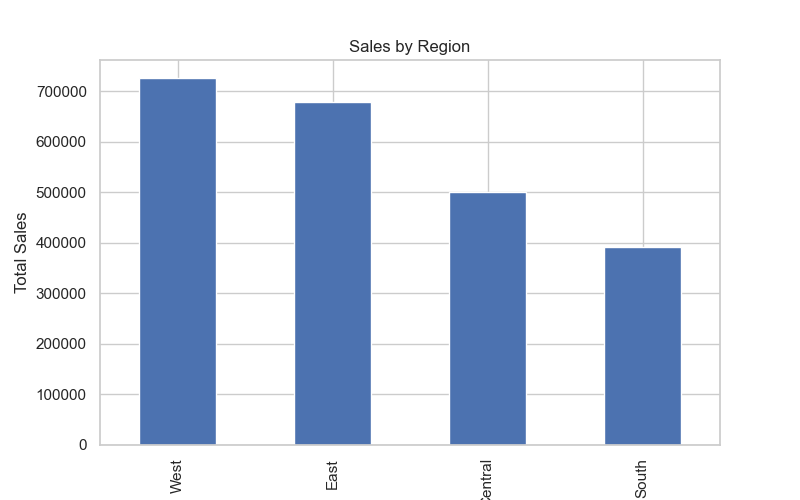

## Sales by Customer Segment
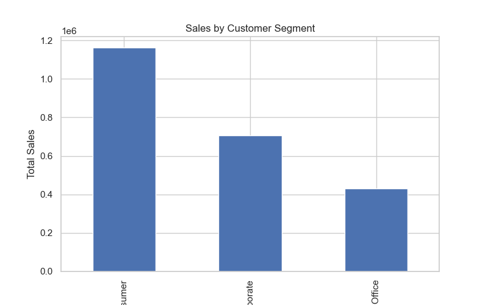

## Orders by Ship Mode
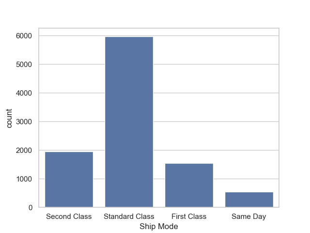

## Sales vs Profit
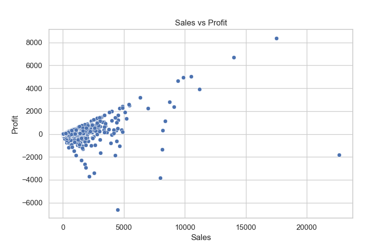

## Discount vs Profit
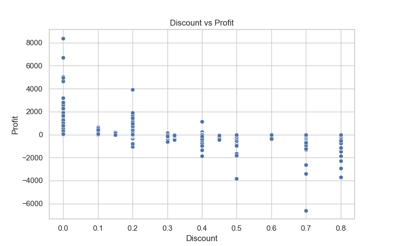

## Correlation Heatmap
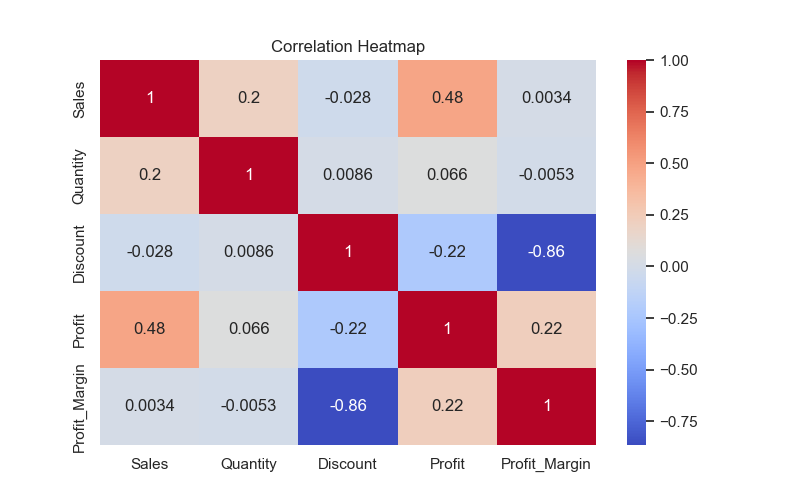

## Top 10 Products by Sales
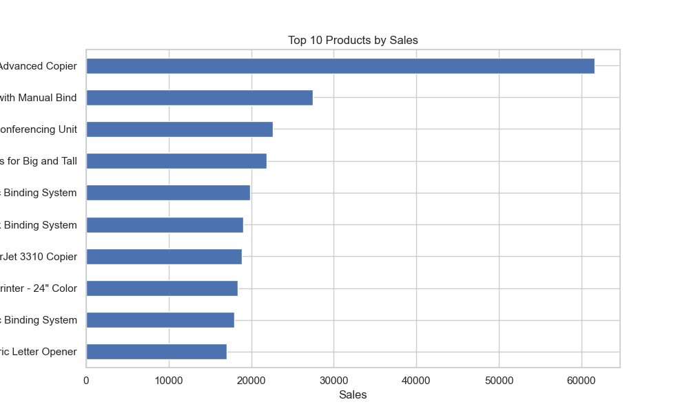

## Customer Segmentation
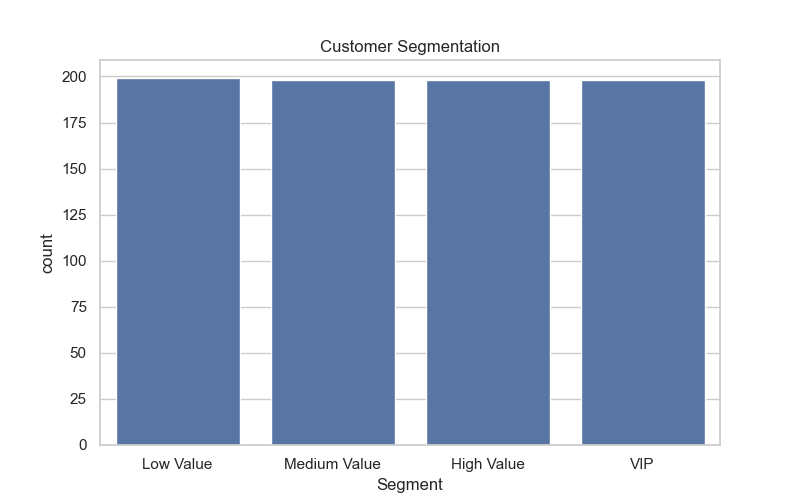

## Customer Segments Share
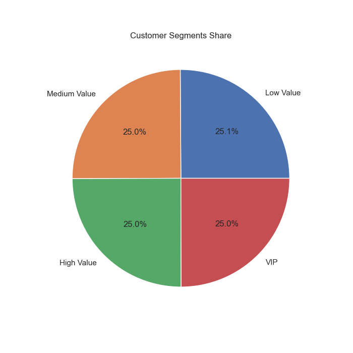

## Top Customers by Sales
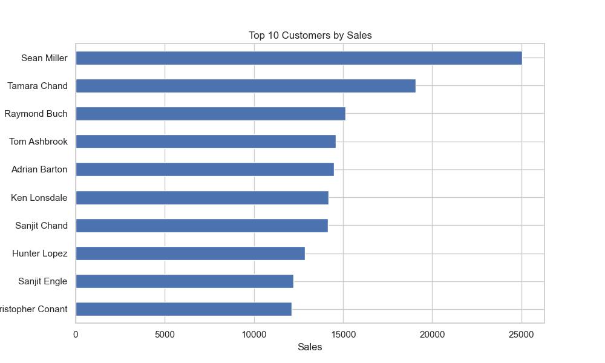

## Top Customers by Profit
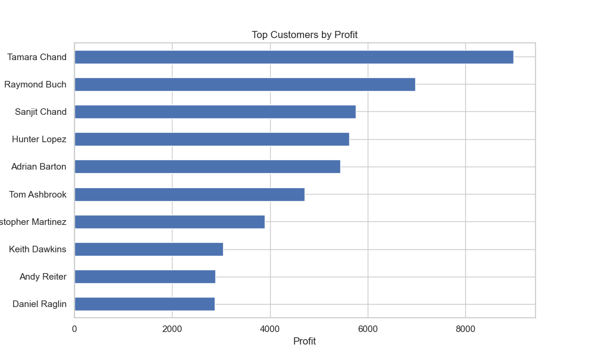

## Top Loss-Making Customers


---


## Conclusion

This project helped me understand:

- Real-world business analysis
- KPI calculation
- Customer segmentation
- Trend analysis
- Sales and profit analysis
- Data visualization
- Business insights using python 

Overall, this project strengthened my practical understanding of Data Analytics and Business Analysis.

---

## Project Structure

```bash
Day1_Customer_Purchase_Analysis/
│
├── data/
├── notebook/
├── charts/
├── insights/
└── README.md
```
## Author
Gayatri Chavhan 

Python| Data Analytics | Business Intelligence
